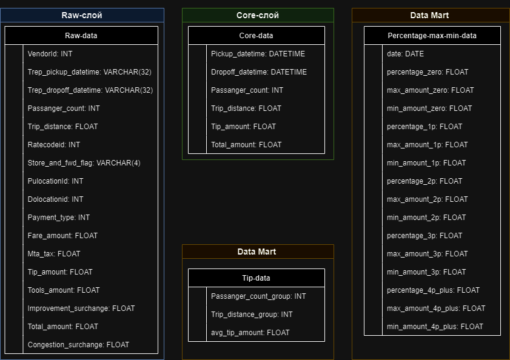

### Название и общее описание проекта.

**Проект № 5 «Служба такси».**

Есть таблица, состоящая из поездок такси в Нью-Йорке.

Необходимо, используя таблицу поездок для каждого дня, рассчитать процент поездок по количеству человек в машине (без пассажиров, 1, 2, 3, 4 и более пассажиров). По итогу должна получиться таблица (`parquet`) с колонками `date`, `percentage_zero`, `percentage_1p`, `percentage_2p`, `percentage_3p`, `percentage_4p_plus`. Технологический стек — sql, scala (что-то одно).
Также добавить столбцы к предыдущим результатам с самой дорогой и самой дешевой поездкой для каждой группы.

Дополнительно: также провести аналитику и построить график на тему «Как пройденное расстояние и количество пассажиров влияет на чаевые» в любом удобном инструменте.

Результат выполнения задания необходимо выложить в github/gitlab и указать ссылку на Ваш репозиторий (не забудьте: репозиторий должен быть публичным).

---

### Цели проекта с описанием бизнес-задачи и требованиями.

**Цели проекта:**
1. **Рассчет процента поездок по количеству пассажиров:** Основной целью проекта является определение процента поездок в зависимости от количества человек в машине (без пассажиров, 1, 2, 3, 4 и более). Это позволит оценить динамику использования такси с различным числом пассажиров.

2. **Создание таблицы результатов в формате parquet:** Поставленная задача требует формирования структурированной таблицы с результатами анализа в формате parquet. Этот формат обеспечит оптимальное хранение данных, что важно для последующей работы с ними и обеспечения производительности.

3. **Добавление данных о самой дорогой и самой дешевой поездке:** Дополнительной целью является расширение результатов анализа путем добавления информации о самой дорогой и самой дешевой поездке для каждой группы пассажиров. Это позволит выделить крайние значения и провести дополнительный анализ экстремальных случаев.

4. **Аналитика и визуализация:** Дополнительно к основной задаче, проект включает в себя проведение аналитики и построение графика на тему «Как пройденное расстояние и количество пассажиров влияет на чаевые». Это позволит выявить взаимосвязи между факторами и оценить влияние параметров поездок на размер чаевых.

**Бизнес-задача:**
Бизнес-задачей проекта является получение структурированных данных, позволяющих понять паттерны и тенденции в использовании такси в зависимости от количества пассажиров, а также выявление факторов, влияющих на размер чаевых. Эта информация может быть использована для оптимизации сервиса такси, адаптации тарифов и улучшения качества обслуживания.

**Требования к проекту:**
1. **Точность анализа:** Результаты анализа должны быть максимально точными и репрезентативными, что обеспечит правильные выводы и рекомендации для бизнеса.

2. **Эффективность обработки данных:** Обработка данных должна быть произведена эффективно, учитывая их значительный объем. Это позволит оптимизировать время выполнения проекта.

3. **Читаемость кода и документация:** Код должен быть написан читаемо и поддерживаемо, а документация к проекту должна включать в себя подробные пояснения и комментарии.

4. **Гибкость анализа:** Решение должно обеспечивать гибкость анализа, позволяя легко вносить изменения и дополнения в случае появления новых требований или вопросов.

5. **Визуализация результатов:** Построение графика по влиянию пройденного расстояния и количества пассажиров на чаевые должно быть реализовано в инструменте визуализации, обеспечивающем понятность и наглядность результатов.

Этот проект направлен на получение важных данных для бизнеса, которые будут использованы для оптимизации услуги такси и улучшения качества обслуживания.

---

### План реализации.

---

### Используемые технологии.

Для решения поставленной задачи я выбрал Pandas с Python и PostgreSQL по нескольким ключевым причинам.

1. **Простота использования и гибкость Pandas:**
   - Pandas с Python предоставляет удобный и интуитивно понятный синтаксис для манипуляций с данными. Это особенно важно, учитывая, что я должен провести агрегацию данных по количеству пассажиров, вычислить проценты и анализировать результаты. Я хотел выбрать инструмент, который позволял бы мне легко и эффективно работать с данными, и Pandas полностью соответствует этим требованиям.

2. **Эффективность SQL-запросов в PostgreSQL:**
   - PostgreSQL предоставляет мощные средства языка SQL, что является необходимым для проведения агрегаций, фильтраций и расчетов статистики по данным. Учитывая, что задача включает в себя сложные запросы и анализ данных, использование реляционной базы данных с поддержкой SQL предоставляет надежный и эффективный способ хранения и получения данных.

Существует несколько причин, почему я не выбрал Apache Spark или Hive и Hadoop:

1. **Сложность настройки и использования:**
   - Apache Spark и Hadoop являются мощными инструментами для обработки больших объемов данных, но они также требуют сложной настройки и управления кластером. В моем случае, где размер данных не настолько велик, использование этих технологий могло бы быть избыточным и сложным в настройке для относительно простой задачи.

2. **Использование реляционной структуры данных:**
   - Моя задача включает анализ данных по относительно простым критериям, таким как количество пассажиров и дни. Использование SQL в PostgreSQL с легкостью позволяет выполнить необходимые операции агрегации и фильтрации, а реляционная структура базы данных лучше соответствует характеру моих данных.

3. **Требования к ресурсам:**
   - Apache Spark и Hadoop требуют значительных ресурсов, и их использование оправдано в случае обработки больших объемов данных на кластере серверов. В данном случае, где объем данных не является критически большим, Pandas с Python и PostgreSQL предоставляют более легкое и простое в настройке решение.

---

### Схемы и архитектуры.

**Структура проекта:**

**Структура хранилища данных:**

---

### Результаты разработки.

---

### Выводы.